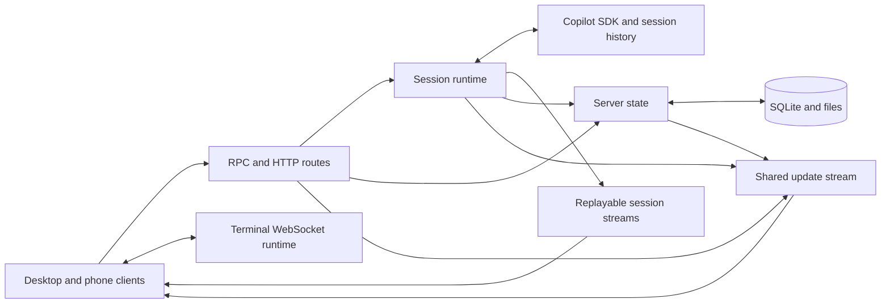

Toy Box is a full stack binary built on the Bun runtime. It uses the GitHub Copilot SDK for agent sessions; TanStack Start and Nitro for the SSR web server, server functions, and HTTP/SSE routes; React, TanStack Router and Query, and Jotai for the client; and Tailwind CSS with shadcn/ui for presentation. Interactive terminals run through a separate Bun WebSocket server in the same process.

## Architecture

Toy Box's central unit of work is a session that runs on the server and outlives any browser connection. A client can create one with its first prompt, attach to work already running, reconnect from a cursor, or reopen an idle session from history. Multiple clients can observe and control the same session; disconnecting ends only that client's observation.

A session ID ties together durable SDK history, at most one live runtime, Toy Box metadata and owned resources, and shared client status. Shared workspace state may reserve that ID and its prompt as a draft; turning it into an SDK session requires the create-with-first-message operation because Toy Box exposes no empty-session creation operation.

Raw Copilot SDK activity is translated into canonical `SessionEvent`s. One pure reducer builds the same session state for the live server runtime, persisted-history replay, and browser clients, so a transcript agrees whether it is watched live, reconnected, or opened after completion. Active sessions take their truth from the in-memory runtime; idle sessions are reconstructed from durable SDK history, with snapshots serving only as a cache.

Automations, Inbox, Hyper, and parent sessions govern managed-session lifecycles while reusing that same runtime rather than defining alternate execution models. Artifacts expose durable files as live, editable surfaces that can notify their owning agent. High-frequency transcript activity travels through ordered, replayable per-session streams. Lower-frequency shared workspace changes use a separate at-most-once update stream and recover missed events from authoritative snapshots or query refetches.

Toy Box currently assumes one trusted, coordinating server process for one owner; it does not provide an authentication boundary or horizontal coordination. SDK history, SQLite metadata, worktrees, and artifact files survive restarts; active execution, replay buffers, workspace coordination, Hyper membership, and terminal PTYs do not.

### Subsystem guides

Each guide explains one capability end to end, including adjacent callers and consumers when its implementation spans folders. Read them in order for a first architecture pass; for a targeted change, start with the guide whose responsibility matches it. A guide's location marks the subsystem's semantic core, not its complete boundary.

- [`src/functions/runtime/AGENTS.md`](src/functions/runtime/AGENTS.md): live session work that outlives clients, with message delivery, replayable observation, and structured completion
- [`src/functions/sdk/AGENTS.md`](src/functions/sdk/AGENTS.md): one stable application language over Copilot SDK events, history, configuration, and tools
- [`src/functions/state/AGENTS.md`](src/functions/state/AGENTS.md): authoritative state and lifecycle across session resources, workspace coordination, and managed sessions
- [`src/functions/automations/AGENTS.md`](src/functions/automations/AGENTS.md): dependable recurring work by scheduling ordinary managed sessions
- [`src/components/workspace/AGENTS.md`](src/components/workspace/AGENTS.md): one pane model composed into desktop, mobile, preview, overlay, Hyper, and Inbox workflows
- [`src/components/workspace/panes/artifacts/AGENTS.md`](src/components/workspace/panes/artifacts/AGENTS.md): durable files presented as live, bidirectionally editable surfaces
- [`terminal-server/AGENTS.md`](terminal-server/AGENTS.md): reconnectable PTYs with mode-aware scrollback that preserves the visible terminal
- [`cli/AGENTS.md`](cli/AGENTS.md): one installable binary that assembles the web application and its independent runtimes
- [`tests/AGENTS.md`](tests/AGENTS.md): live runtime and historical replay behavior locked against real SDK fixtures

## Writing Great Code

Great code pursues simplicity by placing a rich domain model at the center, decomposing it into clear responsibilities, and applying functional principles to express its behavior directly. Architecture, state, control flow, boundaries, and tests should follow from real requirements and preserve the product experience with as little machinery as possible.

- Domain coherence
  - Define the smallest coherent ontology of concepts and relationships, then use that vocabulary consistently across every subsystem and layer. These become the system's nouns; scrutinize every addition.
  - Express operations over those values as domain verbs (the subsystem's algebra). A subsystem's public surface should expose capabilities rather than incidental types, wrappers, or implementation steps.
  - Use that model to make valid states, transitions, true dependencies, expected side effects, and ownership explicit. Prefer one source of truth and representations that exclude invalid combinations when practical.
- Semantic decomposition
  - Decompose the domain into subsystems with independently nameable roles, ownership, and contracts. Each subsystem should expose a coherent capability rather than mirror implementation mechanics.
  - Within each subsystem, give every module and component one semantic responsibility. Create or extract one when it gives a capability a clear owner, removes real repetition, or clarifies composition; inline wrappers that only add indirection.
  - Within each file, optimize for linear top-to-bottom reading. Establish its role, domain concepts, and common control flow before supporting mechanics and edge cases; comment only to explain a non-obvious role or invariant.
- Functional architecture
  - Within each boundary, implement domain behavior as a pure, referentially transparent core over immutable values, with explicit inputs, outputs, and transitions.
  - Isolate unavoidable effects, including UI animation, persistence, timers, and external communication, at the owning component or module boundary, with explicit lifetimes and failure behavior.
  - Compose subsystems through narrow contracts. Keep policy and orchestration with their owning layer, and share only genuinely generic mechanics.
- Verifiable contracts
  - Encode domain invariants and policy in executable tests. Verify observable behavior, valid transitions, lifecycle outcomes, and boundary guarantees rather than private implementation details or duplicated logic.
  - Concentrate exhaustive coverage around foundational state machines, reducers, policies, codecs, and boundaries where one defect propagates widely. Test leaf consumers when they own distinct behavior, lifecycle, or integration risk.
  - Keep tests deterministic and readable as specifications: order common behavior before edge cases, prove one contract per test, and introduce narrow seams or protocol-faithful fakes only when needed.

For model examples, see [`src/functions/sdk/projector.ts`](src/functions/sdk/projector.ts) and [`src/functions/sdk/projector.test.ts`](src/functions/sdk/projector.test.ts).

## Definition of Done

- For changes to React components or hooks, use the `react-review` skill on the changed files and their relevant lifecycle owners before final validation.
- Run `bun format` and fix any formatting issues.
- Run `bun lint` and fix any lint issues.
- Run `bun check` and fix any typecheck issues.
- Run `bun test` and fix any failing tests.
- For significant changes, dogfood the change with the `dogfood` skill.
