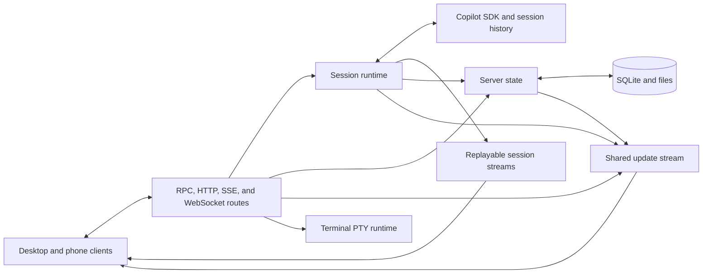

Toy Box is a full stack binary built on the Bun runtime. It uses the GitHub Copilot SDK for agent sessions; TanStack Start and Nitro for the SSR web server, server functions, and HTTP/SSE/WebSocket routes; React, TanStack Router and Query, and Jotai for the client; and Tailwind CSS with shadcn/ui for presentation.

## Architecture

Toy Box's central unit of work is a session that runs on the server and outlives any browser connection. A client can create one with its first prompt, attach to work already running, reconnect from a cursor, or reopen an idle session from history. Multiple clients can observe and control the same session; disconnecting ends only that client's observation.

A session ID ties together durable SDK history, at most one live runtime, Toy Box metadata and owned resources, and shared client status. A durable draft claim reserves that ID, and the SDK's experimental empty-session surface creates its workspace and optional artifact without creating resumable event history. The first message starts the turn-bearing SDK session over that same workspace. An artifact-first draft treats its file as both the preferred pane and the initial conversational subject supplied to the agent.

Raw Copilot SDK activity is translated into canonical `SessionEvent`s. One pure reducer builds the same session state for the live server runtime, persisted-history replay, and browser clients, so a transcript agrees whether it is watched live, reconnected, or opened after completion. Active sessions take their truth from the in-memory runtime; idle sessions are reconstructed from durable SDK history, with snapshots serving only as a cache.

Automations, Inbox, Hyper, and parent sessions govern managed-session lifecycles while reusing that same runtime rather than defining alternate execution models. Files open as live, editable editor surfaces that can notify their owning agent. High-frequency transcript activity travels through ordered, replayable per-session streams. Lower-frequency shared workspace changes use a separate at-most-once update stream and recover missed events from authoritative snapshots or query refetches.

The app runtime supports two ownership models. Installed apps are durable, bookmarked workspace surfaces: a TSX definition supplies trusted owner-authored presentation, behavior, and default state, while each SQLite-backed instance supplies its own title, small durable state, and revision. Session artifact apps are ordinary `.toy` files rendered by editor panes with no manifest, registration, or durable app state. Both consume the same versioned portable wrapper over workspace state, sessions, and files and can publish ordinary session or editor panes without introducing another execution model.

```mermaid
flowchart LR
    Clients[Desktop and phone clients] <--> API[RPC, HTTP, SSE, and WebSocket routes]
    API --> Runtime[Session runtime]
    Runtime <--> SDK[Copilot SDK and session history]
    Runtime --> Streams[Replayable session streams]
    Streams --> Clients
    API --> State[Server state]
    Runtime --> State
    State <--> Database[(SQLite and files)]
    API --> Updates[Shared update stream]
    Runtime --> Updates
    State --> Updates
    Updates --> Clients
    API --> Terminal[Terminal PTY runtime]
```

Toy Box currently assumes one trusted, coordinating server process for one owner; it does not provide an authentication boundary or horizontal coordination. SDK history, SQLite metadata, worktrees, and artifact files survive restarts; active execution, replay buffers, workspace coordination, Hyper membership, and terminal PTYs do not.

### Subsystem guides

Each guide explains one capability end to end, including adjacent callers and consumers when its implementation spans folders. Read them in order for a first architecture pass; for a targeted change, start with the guide whose responsibility matches it. A guide's location marks the subsystem's semantic core, not its complete boundary.

- [`src/features/sessions/AGENTS.md`](src/features/sessions/AGENTS.md): the foundational session model, runtime, registry, SDK projection, browser lifecycle, and presentation
- [`src/workspace/AGENTS.md`](src/workspace/AGENTS.md): aggregate workspace state, synchronization, pane identity, and layout composition
- [`src/features/automations/AGENTS.md`](src/features/automations/AGENTS.md): dependable recurring work by scheduling ordinary managed sessions
- [`src/features/inbox/AGENTS.md`](src/features/inbox/AGENTS.md): durable background results presented through ordinary managed sessions
- [`src/features/workers/AGENTS.md`](src/features/workers/AGENTS.md): owner-scoped background work supervised as ordinary managed sessions
- [`src/features/apps/AGENTS.md`](src/features/apps/AGENTS.md): session artifact apps, installed definitions and instances, shared compilation, and the public app capability boundary
- [`src/features/files/AGENTS.md`](src/features/files/AGENTS.md): browsable workspace files presented as live, bidirectionally editable surfaces
- [`src/features/terminal/AGENTS.md`](src/features/terminal/AGENTS.md): reconnectable PTYs with mode-aware scrollback that preserves the visible terminal
- [`cli/AGENTS.md`](cli/AGENTS.md): one installable binary that assembles the browser app and Nitro server
- [`tests/AGENTS.md`](tests/AGENTS.md): live runtime and historical replay behavior locked against real SDK fixtures

## Writing Great Code

Great code pursues simplicity by placing a rich domain model at the center, decomposing it into clear responsibilities, and applying functional principles to express its behavior directly. Architecture, state, control flow, boundaries, and tests should follow from real requirements and preserve the product experience with as little machinery as possible.

- Domain coherence
  - Define the smallest coherent ontology of concepts and relationships, then use that vocabulary consistently across every subsystem and layer. These become the system's nouns; scrutinize every addition.
  - Express operations over those values as domain verbs (the subsystem's algebra). A subsystem's public surface should expose capabilities rather than incidental types, wrappers, or implementation steps.
  - Use that model to make valid states, transitions, true dependencies, expected side effects, and ownership explicit. Prefer one source of truth and representations that exclude invalid combinations when practical.
- Semantic decomposition
  - Decompose the domain into subsystems with independently nameable roles, ownership, and contracts. Each subsystem should expose a coherent capability rather than mirror implementation mechanics.
  - Within each subsystem, give every module and component one semantic responsibility. Create or extract one when it gives a capability a clear owner, removes real repetition, or clarifies composition; inline wrappers that only add indirection.
  - Within each file, optimize for linear top-to-bottom reading. Establish its role, domain concepts, and common control flow before supporting mechanics and edge cases; comment only to explain a non-obvious role or invariant.
- Functional architecture
  - Within each boundary, implement domain behavior as a pure, referentially transparent core over immutable values, with explicit inputs, outputs, and transitions.
  - Isolate unavoidable effects, including UI animation, persistence, timers, and external communication, at the owning component or module boundary, with explicit lifetimes and failure behavior.
  - Compose subsystems through narrow contracts. Keep policy and orchestration with their owning layer, and share only genuinely generic mechanics.
- Verifiable contracts
  - Encode domain invariants and policy in executable tests. Verify observable behavior, valid transitions, lifecycle outcomes, and boundary guarantees rather than private implementation details or duplicated logic.
  - Concentrate exhaustive coverage around foundational state machines, reducers, policies, codecs, and boundaries where one defect propagates widely. Test leaf consumers when they own distinct behavior, lifecycle, or integration risk.
  - Keep tests deterministic and readable as specifications: order common behavior before edge cases, prove one contract per test, and introduce narrow seams or protocol-faithful fakes only when needed.

For model examples, see [`src/features/sessions/server/sdk/projector.ts`](src/features/sessions/server/sdk/projector.ts) and [`src/features/sessions/server/sdk/projector.test.ts`](src/features/sessions/server/sdk/projector.test.ts).

## Definition of Done

- For code changes, use the `review` skill on the changed files and their relevant domain, boundary, lifecycle, and consumer context before final validation.
- Run `bun check` and fix any formatting, lint, or typecheck issues.
- Run `bun test` and fix any failing tests.
- For significant changes, dogfood the change with the `dogfood` skill.
