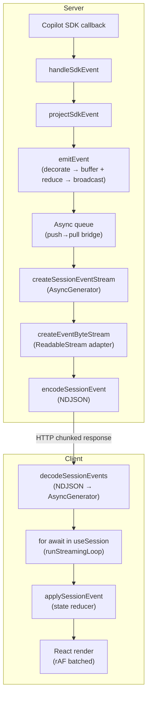
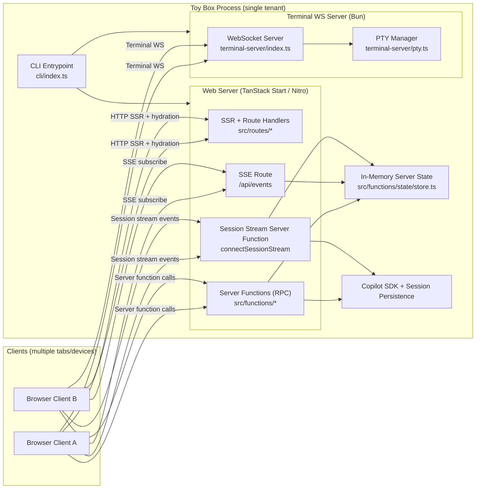
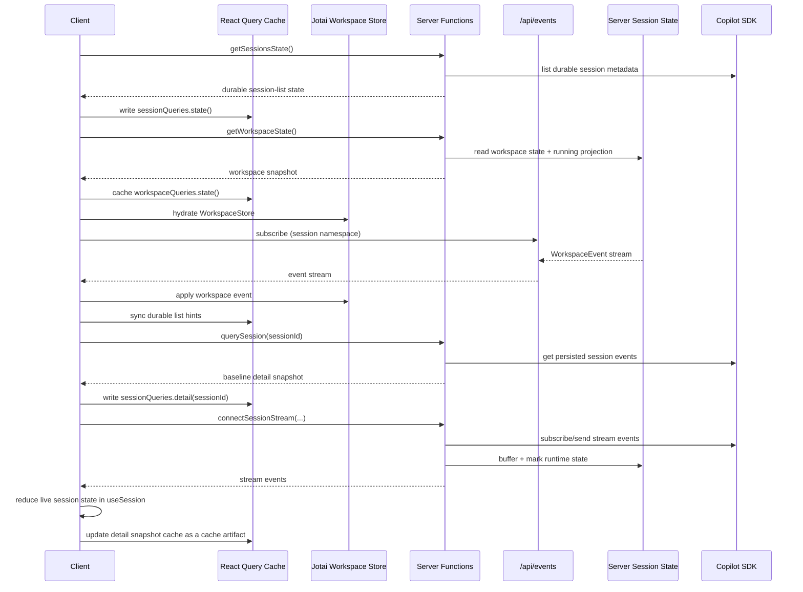

# Toy Box Design

This doc is a quick architectural refresher for maintainers.

Toy Box is a single-tenant server with multi-client realtime behavior. Multiple tabs/devices can connect at the same time, and they converge on shared session/terminal state through server-managed realtime channels.

## System Context

### At A Glance

- One executable runs the full stack (CLI entrypoint + web server + terminal WebSocket server).
- SSR provides fast first paint; React hydration provides client interactivity.
- Sessions use three coordinated state paths: durable resources (session list, models, skills, automations), workspace state (drafts, prompts, unread, hyper, running), and per-session detail (messages, status, queued work).
- Realtime updates are pushed to clients and applied at the layer that owns the state: Jotai for workspace state, React Query for durable list/automation caches, and `useSession` for one open session's live reducer.

### Design Constraints

Mental model: this architecture is intentionally optimized for one process serving multiple clients.

- Tenancy: single tenant, multi-client (tabs/devices for one owner/workspace).
- Process model: realtime coordination is in-memory and process-local.
- Scaling assumption: horizontal scaling is not supported without adding shared state/pubsub.
- Trust model: no auth layer is described here; deployments should be treated as trusted/private.

### State and Durability

Mental model: not all state has the same persistence guarantees.

- Durable state:
  - session history persisted by Copilot SDK
- Process-local server state (lost on process restart):
  - streaming buffers
  - workspace state: drafts, draft prompts, unread markers, and hyper membership
  - queued in-flight messages
  - active session object cache
  - live terminal PTY sessions
- Client-local state:
  - React Query caches
  - Jotai workspace store and local UI atoms
  - per-open-session reducer refs inside `useSession`
  - local optimistic UI state

The key implication is that restart recovery is history-first: durable session history remains, transient realtime coordination is rebuilt.

## Runtime Architecture

### Full Stack Binary

Mental model: one process hosts everything needed for local use and multi-client access.

- Build pipeline step 1: `vite build` produces Nitro/TanStack Start server output and web assets.
- Build pipeline step 2: `bun build --compile ./cli/index.ts --outfile toy-box` produces the `toy-box` executable.
- Runtime entrypoint: `cli/index.ts`.
- Runtime responsibilities:
  - start terminal WS backend (`terminal-server/index.ts`)
  - start web server from built Nitro output (`.output/server/index.mjs`)
  - expose UI, server functions, SSE route, and stream endpoints

### Boot Sequence

At startup, the CLI bootstraps both realtime backends and the web runtime.

- Process entrypoint initializes environment/runtime knobs.
- Terminal WS server starts first.
- Nitro/TanStack Start server is imported and starts serving routes/functions.
- Clients can then attach over HTTP, SSE, stream server functions, and WS.

### SSR and Hydration

Mental model: render on server first, then hydrate into a realtime client.

- Root SSR shell is defined in `src/routes/__root.tsx`.
- React Query is the client-side state/cache layer for baseline data and refetch policy.

This gives fast initial render with responsive client behavior after hydration.

### Client State Library Roles

Mental model: each client state tool has one job.

- **TanStack Start server functions** are the typed RPC boundary for reads and mutations (`getSessionsState`, `getWorkspaceState`, `querySession`, `dispatchWorkspaceAction`, stream functions).
- **React Query** owns fetched resources and refetch healing: durable session-list metadata, session detail snapshots, models, skills, automations, and the baseline/refetch `WorkspaceState` snapshot.
- **Jotai** owns shared reactive client stores: the live `WorkspaceStore` reduced from `WorkspaceEvent`s, pane focus/link atoms, and hyper surface UI state.
- **React hooks** own lifecycle integration: `useWorkspace` installs the workspace event sink, hydration/reconnect policy, and optimistic `WorkspaceAction` dispatch; `useSession` owns one open session's live stream reducer; feature hooks adapt domain state for components.

React Query is not used as the app's reducer store, and Jotai is not used to fetch server resources. The handoff is: server snapshot through React Query, then live workspace updates through the Jotai store, with `useWorkspace` as the action boundary and React Query refetch as the repair path.

### Server Functions and Routes

- Server functions are the typed RPC boundary for app operations (sessions, runtime config, mutations).
- API route `/api/events` carries namespaced realtime updates over SSE (sessions + automations).
- Session detail realtime transport uses a stream-returning server function (`connectSessionStream`).

## Realtime Subsystems

### Workspace State Channel (SSE)

Scope: workspace coordination facts (`drafts`, `draftPrompts`, `runningSessionIds`,
`unreadSessionIds`, and `hyperSessionIds`) plus durable session-list hints
(`session.upserted`, `session.deleted`).

- Workspace baseline source: `getWorkspaceState` via `workspaceQueries.state()`.
- Durable list baseline source: `getSessionsState` via `sessionQueries.state()`.
- Realtime source: SSE `GET /api/events` (`src/routes/api/events.ts`) consumed via `useServerEvents({ namespace: "session" })`.
- Workspace integration: `useWorkspace` applies accepted `WorkspaceEvent`s to the Jotai workspace store and dispatches optimistic `WorkspaceAction`s through one server function.
- React Query integration: `src/lib/session/queryCache.ts` only syncs durable session-list cache data from `session.upserted` and `session.deleted`.

This keeps list-level updates cheap and shared across all connected clients.

### Automations Subsystem

Scope: scheduled prompts that run on cron and surface in the sidebar as automation entries.

- Baseline source: `listServerAutomations` via `automationQueries.list()`.
- Durable model: `src/functions/automations/data.ts` persists automations in SQLite (`db0`) with `cron`, `reuseSession`, optional `cwd`, and run metadata (`nextRunAt`, `lastRunAt`, `lastRunSessionId`).
- Scheduler runtime: `src/functions/automations/scheduler.ts` starts once per process and polls every 30 seconds; each tick claims due rows transactionally and reschedules before dispatch.
- Startup wiring: `src/server/plugins/automationScheduler.ts` starts the scheduler during Nitro boot (configured in `vite.config.ts`).
- Run execution model:
  - reuse existing `lastRunSessionId` when `reuseSession` is enabled, otherwise create a new session ID via `toy-box-auto-<automationId>--run-<uuid>`
  - set the session summary to the automation title for list readability
  - if the reused session is currently streaming, queue the prompt instead of sending immediately
  - emit `automation.started` and `automation.finished` (success/failure) from observed session terminal events
- Realtime transport: automation updates are multiplexed onto `/api/events` and consumed with `useServerEvents({ namespace: "automation" })`.
- Client cache + UI:
  - `src/hooks/automations/cache.ts` folds `automation.*` events into React Query
  - `src/hooks/automations/useAutomations.ts` manages mutations and running state (`serverRunningCounts + pendingRunCounts + streaming session inference`)
  - `src/components/sidebar/automation/AutomationPanel.tsx` provides create/edit/delete/run UX, simple schedule builder (daily/interval/cron), model selection, optional directory, and reuse-session toggle
- Session-list coupling: `src/routes/index.tsx` hides reusable automation target sessions from the main session list to avoid duplicate sidebar entries while still allowing open/select from the automation panel.

### SDK Event Pipeline

Mental model: a linear pipeline transforms raw SDK events into UI state.

The Copilot SDK emits untyped session events during both streaming and history replay. These are transformed into canonical `SessionEvent` values through a four-stage pipeline:

1. **Extractors** (`src/functions/sdk/extractors.ts`): Defensive field accessors over untyped `Record<string, unknown>` event data. Centralises runtime narrowing so downstream stages stay declarative.
2. **Projector** (`src/functions/sdk/projector.ts`): Maps SDK events into canonical `SessionEvent` values. A declarative dispatch table with mode wrappers (`streamingOnly` / `historyOnly`) controls which events emit in each context. Hidden tools (e.g. `read_agent`) are filtered at the single `projectSdkEvent` entry point via toolCallId tracking, so they never reach the reducer.
3. **Reducer** (`src/lib/session/sessionReducer.ts`): Pure state machine that applies `SessionEvent` values to `SessionState`. Mutation-based for performance, idempotent for safe reconnect replay. Shared by server snapshots, live streaming, and history replay.
4. **Codec** (`src/lib/session/streamCodec.ts`): NDJSON encode/decode for `SessionEvent` transport over HTTP streaming. Handles partial lines across chunk boundaries.

The boundary between SDK-specific and app-domain code is the `SessionEvent` type: the `sdk/` modules produce it, `lib/session/` modules consume it.

### Session Detail Channel (Stream Server Function)

Mental model: this channel owns high-frequency realtime state for each open session pane.

- Scope: one conversation's detailed state (messages, queued messages, status, reasoning, todo).
- Baseline source: `querySession` via `sessionQueries.detail(sessionId)`.
- Realtime source: `connectSessionStream` (server function stream events).
- Event processing: history and stream events share one canonical application path (`applySessionEvent`) through the state reducer.

Open sessions in grid/single view each own this detail channel, while sharing list metadata from SSE.

#### Why this complexity exists (user benefit mapping)

This subsystem is intentionally layered. Each layer exists to satisfy a specific user-visible behavior under real network and multi-client conditions.

- Server-side streaming buffer + event cursor (`afterEventId`, `eventId`):
  - User benefit: refresh/reconnect resumes from the correct point without duplicate replay or losing in-flight output.
- Distinct disconnect vs abort semantics:
  - User benefit: backgrounding a session can continue processing; pressing Stop cancels processing. User intent is preserved.
- Server-owned runtime fanout (`sessionRuntimes` listeners):
  - User benefit: multiple tabs/devices watching the same session converge on the same live state with low latency.
- Server-owned queued messages:
  - User benefit: messages sent while a response is running are not lost across navigation/reconnect and remain cancellable.
- Canonical event model + shared reducer (`applySessionEvent`):
  - User benefit: history replay and live updates produce the same UI behavior, reducing "stale history vs live stream" inconsistencies.
- Async generator stream production (`createSessionEventStream`):
  - User benefit: predictable lifecycle around replay, live events, and teardown, which lowers edge-case failures during reconnect/stop.
- Async generator wrapped in `ReadableStream` + `RawStream`:
  - User benefit: explicit transport cancellation/cleanup and robust framed RPC delivery for long-running, high-frequency streams.
- Event codec (`encodeSessionEvent` / `decodeSessionEvents`):
  - User benefit: incremental rendering stays stable as data arrives, with a deterministic wire format for stream event boundaries.

This is not complexity for its own sake. The goal is reliable continuity (resume/stop/reconnect), multi-client consistency, and predictable UI state under non-ideal network conditions.

#### Streaming Pipeline (E2E)

Mental model: a single SDK callback becomes a React render through a chain of single-purpose stages with no shortcuts.

**Server** (`src/functions/runtime/stream/index.ts` → `src/functions/sessions.ts`):

1. SDK fires a callback → `handleSdkEvent` receives it.
2. `projectSdkEvent` maps the SDK event into canonical `SessionEvent` values (filtering empty deltas and hidden tools).
3. `emitEvent` applies a three-step pipeline to each event:
   - **Decorate**: stamp with monotonic `eventId` and `turnId` (enables reconnect cursors).
   - **Apply**: append to streaming buffer + reduce into server-side `SessionState` snapshot.
   - **Broadcast**: push to all connected subscribers (one per HTTP client).
4. Each subscriber's `push()` feeds a `createAsyncQueue` — a minimal push→pull bridge between the callback-driven SDK and the pull-driven generator.
5. `createSessionEventStream` (AsyncGenerator) pulls from the queue and yields events.
6. `createEventByteStream` adapts the generator into a `ReadableStream` (required by TanStack's `RawStream`).
7. `encodeSessionEvent` serializes each event as NDJSON (`JSON + "\n"` → `Uint8Array`).

**Wire**: chunked HTTP response body.

**Client** (`src/hooks/session/useSession.ts`):

8. `decodeSessionEvents` reassembles NDJSON from chunked bytes, yielding `SessionEvent` values.
9. `runStreamingLoop` iterates with `for await`, calling `applyEvent` for each event.
10. `applyEvent` feeds the shared `applySessionEvent` reducer (mutates a state ref), then schedules a React render — immediately for discrete events, or batched via `requestAnimationFrame` for high-frequency deltas.

### Terminals (WebSocket + PTY)

The terminal runtime is a separate backend in `terminal-server/` that manages
PTY sessions over WebSocket and preserves terminal continuity across reconnects.

For terminal-server responsibilities, lifecycle rules, protocol contracts, and
replay behavior, see `terminal-server/AGENTS.md`.

### Consistency and Recovery

Mental model: server is authoritative; clients optimize for responsiveness then converge.

- Baseline truth comes from server functions (`getSessionsState`, `getWorkspaceState`, `querySession`).
- Workspace truth comes from `getWorkspaceState`, then live `WorkspaceEvent`s keep the Jotai workspace store current.
- Realtime channels (SSE + stream events) keep active clients up to date with low latency.
- Clients perform optimistic/local updates where needed, then reconcile using stream completion and query invalidation/refetch.
- Focus/reconnect refetch policies provide a safety net for missed realtime updates.
- After process restart, clients recover durable session history first; transient runtime state repopulates as activity resumes.

## Appendix

### Runtime Topology Diagram

### Sessions Data Flow Diagram

### Key File Map

**`cli/`** — CLI entrypoint and binary build target

- `index.ts` — process entrypoint; starts terminal WS server + web server

**`terminal-server/`** — Bun-native WebSocket server for PTY terminal sessions

- See `AGENTS.md` for responsibilities, lifecycle rules, and protocol contracts

**`src/routes/`** — SSR route handlers and API endpoints

- `__root.tsx` — root SSR shell
- `api/events.ts` — unified SSE route for session + automation realtime updates

**`src/functions/sdk/`** — Copilot SDK boundary (would be replaced if backend changes)

- `client.ts` — singleton SDK client lifecycle and session CRUD
- `extractors.ts` — defensive field accessors over untyped SDK event data
- `projector.ts` — maps SDK events into canonical `SessionEvent` values

**`src/functions/state/`** — process-local server state (lost on restart)

- `sessionRegistry.ts` — SDK session cache and session create/delete lifecycle
- `snapshotCache.ts` — cached idle snapshots reconstructed from SDK history
- `workspace/` — workspace state facets for drafts, draft prompts, unread markers, hyper membership, and workspace snapshots

**`src/functions/automations/`** — automation scheduling and persistence

- `scheduler.ts` — cron-driven poll loop; claims and dispatches due automations
- `data.ts` — SQLite persistence for automation definitions and run metadata

**`src/functions/runtime/stream/`** — per-session streaming runtime

- `index.ts` — event pipeline (SDK callback → decorated event → buffer + reduce → broadcast), turn lifecycle, queued-message drain loop, and the `connectSessionStream` runtime
- `buffer.ts` — replayable stream buffer with monotonic event IDs

**`src/functions/`** — server function RPC boundary

- `sessions.ts` — session server functions (create, resume, delete, send, stream); also owns the `createEventByteStream` ReadableStream adapter for TanStack `RawStream`
- `automations.ts` — automation server functions (list, create, update, delete, run)

**`src/lib/session/`** — app-domain session logic (SDK-agnostic, consumes `SessionEvent`)

- `sessionReducer.ts` — pure state machine; applies events to `SessionState`
- `streamCodec.ts` — NDJSON encode/decode for `SessionEvent` over HTTP
- `queryCache.ts` — React Query cache helpers for sidebar session list metadata

**`src/hooks/`** — client-side React hooks

- `workspace/useWorkspace.ts` — workspace state hydration, SSE event sink, reconnect healing, and open-session read clearing
- `session/useSessions.ts` — durable session-list query adapter
- `session/useSession.ts` — per-session detail stream and state management
- `session/useDrafts.ts`, `session/useDraftPrompt.ts`, `session/useHyperSessions.ts` — workspace state adapters for draft, prompt, and hyper session behavior
- `automations/useAutomations.ts` — automation mutations and running state
- `automations/cache.ts` — folds automation SSE events into React Query

**`src/components/sidebar/automation/`** — automation UI

- `AutomationPanel.tsx` — create/edit/delete/run UX, schedule builder, model selection
