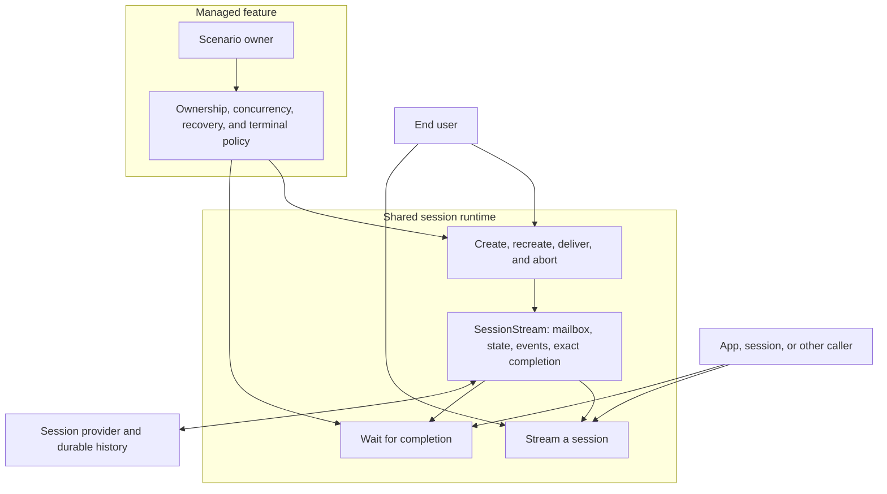

# Session Runtime

A session is Toy Box's core compute primitive: an addressable agent process that can outlive the browser that started it, receive queued messages, and serve multiple subscribers and callers. Its durable identity, provider history, workspace, and owned resources survive individual executions; `SessionStream` is the one live incarnation currently processing that session's mailbox. This resembles the Erlang/Elixir process model as an architectural analogy, not as an implementation claim about isolation or fault tolerance.

The end user directly supervises an ordinary session. Managed features instead govern sessions they own. Every waiter uses the same session completion mechanism; a supervisor is distinguished by lifecycle authority, not a special kind of wait. It owns admission, concurrency, context, cancellation, recovery, and what to retain, delete, record, or publish when execution ends. The runtime supplies the common process mechanics and exact execution receipts without defining a generic supervisor abstraction.

## Session operations

The runtime exposes the session operations directly:

1. **Create** provider history through the first message. A draft already owns a public ID and optional files, and creation binds its ID to the selected provider without changing workspace identity.
2. **Recreate** a session through a new first message, retaining its public ID. `recreateSession` takes the same message and creation options as `createSession`: it privately deletes the previous session and its resources, publishes a fresh draft, then creates through the normal provider path. The caller chooses the new model and role; ordinary sessions default to the standard role. A failed creation removes the replacement draft. Automations is the main consumer and owns its rule against overlapping runs.
3. **Deliver** a message to an existing session. The runtime decides whether it starts immediately or queues behind active execution; a queued user message may request immediate delivery.
4. **Stream** through a subscription to ordered live events, with cursor replay after reconnect.
5. **Wait** for completion. `waitForSessions` covers the announced, live, or latest persisted execution for each session ID; a delivery receipt binds a supervisor to the exact execution it started.
6. **Control** by renaming, steering or cancelling queued input, aborting, rewinding an idle conversation, deleting, or applying worktree operations.

Control is a category, not one runtime method. Abort, queue steering, and queue cancellation act on live execution; rename, deletion, and worktree commands delegate through the session API to the registry or resource owner described in the state guide. Rewind resolves the selected user-message timestamp against the provider's current rewind boundaries, removes that root user turn and every later conversation event while preserving files, and lets the provider reject a concurrent busy session. Queue status supplies the submission claim shared by normal draining and steering; steering uses the provider connection without opening another turn boundary.

Once a session has turn-bearing history, resume is not a separate operation. Delivering to an idle session resumes its persisted provider connection; delivering to an active session queues. Callers do not choose whether a new turn starts or a message enters the active mailbox, though an active user delivery may request immediate dispatch.

`streamSession` is the connected composite: it subscribes before delivering an optional message, preventing a fast first event from falling between separate requests. The same request can start a draft's first turn or create a session with its required first message, deliver to an existing session, or subscribe without delivering. Headless callers use `createSession`, `recreateSession`, `deliverSessionMessage`, and `waitForSessions` directly. Scenario supervisors compose those operations with their own policy.

## Live execution

`SessionStream` names the live runtime for one session, not the event stream a client reads. It owns the provider connection instance, canonical state, queued messages, completion waiters, and replayable event bus for that execution lifetime.

A managed feature may announce work before its live stream exists. `registerPendingSessionCompletion` reserves ID-based completion before publication and retains its settlement briefly, so a caller cannot miss an execution that starts, finishes, and is deleted quickly. The [Workers feature](../../../workers/AGENTS.md) owns the admission and lifetime policy that uses this capability.

Managed features supervise sessions because their terminal policies differ. The runtime centralizes execution and exact completion; scenario-specific policy stays with its owner rather than entering an enum, strategy interface, or alternate execution model.

1. Acquisition is single-flight. Before a new execution acquires a provider connection, the registry refreshes
   configuration when its application-supplied lifetime requires it. This lets a Channel-owned Worker
   receive current identity and collaboration instructions between executions. Active delivery never
   refreshes that session. A caller joins an existing stream, shares an in-progress creation, creates a
   new provider connection, or resumes an idle session from its reduced snapshot and cached provider
   connection.
2. Connected callers subscribe before delivery. Every logical message has a unique client ID; `SessionStream.deliver` synchronously claims the first turn or emits `message_queued` behind active execution. A queue entry is `queued` while cancellable, `submitting` while its provider call is in flight, and `submitted` until the provider echoes it. Only queued user messages can be steered. Each provider associates native message identity with the client ID and adds it to canonical input events after filtering native subagent and skill inputs. That event removes a queued input, reconciles browser optimism when present, and otherwise appends normally.
3. Each provider translates raw events into canonical `SessionEvent`s. The event bus stamps a process-monotonic `eventId`, and the shared reducer returns the next immutable `SessionState`.
4. When the provider emits `end`, the runtime consumes it and drains the next queued message through the same path. With no queued work, the runtime finishes the execution. A `session_title_changed` event updates workspace metadata and does not enter transcript state or its event stream.
5. Finishing publishes one terminal `end`, caches the resulting clean state, selects idle or unread from the active subscriptions, and then disposes the live runtime. Disposing closes the event bus, resolves waiters, removes the provider listener, and removes the stream registry entry; finishing then returns the provider connection to the state registry's bounded idle cache. Aborting interrupts provider work and then finishes; session deletion aborts provider work and removes the live runtime without publishing ordinary idle/unread state.

Files observation has a server lifetime independent of execution. Its shared artifact watcher reports
changes beneath the Session storage root and supplies open editors. `refreshSessionArtifacts` updates an affected live
stream through canonical events containing the current file list; idle snapshots read the files when loaded.
Streams neither own filesystem watchers nor wait for artifact discovery at turn completion.

A delivery receipt exposes the initial `started` or `queued` decision and a waiter bound to that exact stream instance. Completion reports `completed`, `failed`, or `timed_out`, plus the latest substantive assistant response when available. Waiting by session ID also covers work announced before its stream exists and falls back to the final snapshot when no live stream remains. A timeout ends only that caller's wait; it does not abort the session or alter its supervisor's policy.

A supervisor that retains durable history but expects little immediate reuse may call
`releaseIdleSession` after completion. This disconnects only a session with no active execution;
ordinary bounded provider operations independently restart the idle window when they finish.

## Subscriptions and client orchestration

The per-session event bus provides bounded cursor replay and live fan-out. It registers a subscriber immediately, before iteration begins, so synchronous producers cannot outrun subscription. Existing subscribers retain pending events when future replay is cleared between message deliveries; clients that miss more than the retained window recover from the authoritative detail snapshot.

Subscriptions are either `active` or `passive`. Both receive the same live data. An active subscription acknowledges that the user is watching, so a clean finish becomes idle; a stream that finishes without one becomes unread. Passive previews stay live without suppressing that unread transition.

`useSession` is the browser orchestration boundary for one pane. It hydrates an idle snapshot, subscribes while visible, reduces incoming events, batches rapid text deltas to animation frames, and ends its subscription immediately when the pane closes or the page becomes hidden. Ending a subscription does not stop server work; aborting is the separate control that does. `SessionPane` composes this lifecycle with transcript presentation, linked panes, and the composer without owning runtime policy.

## Realtime planes

Toy Box keeps two event planes separate because they promise different things:

| Plane                | Contract                                                                                                                      |
| -------------------- | ----------------------------------------------------------------------------------------------------------------------------- |
| Session event stream | One session, ordered canonical events, cursor replay, multi-client fan-out, and terminal `end`                                |
| Shared update stream | `WorkspaceEvent` hints, at-most-once delivery, no replay, and repair through authoritative snapshots or React Query refetches |

Transcript continuity belongs to the session event stream. Drafts, running and unread state, Inbox entries, session-list metadata, and automation changes belong to the shared update plane. The `/api/workspace` SSE transport carries one `WorkspaceEvent` algebra, while client-issued `WorkspaceAction`s are commands sent through RPC. Broadcast is its internal fan-out mechanism, not another protocol; one failed client listener cannot fail the producing operation or interrupt the other clients. Do not add transcript replay semantics to broadcast or use broadcast as session truth.

## Boundaries and invariants

- The top-level session server functions validate transport input and delegate. Runtime policy belongs here, Native translation belongs in [Providers](../../../providers/AGENTS.md), and authority or teardown belongs in [`../state/AGENTS.md`](../state/AGENTS.md).
- [`../../model/reducer.ts`](../../model/reducer.ts) is the one transition function for live server state, provider history replay, browser streaming, and reconnect replay. Adding a second event interpretation path is an architectural regression.
- Session deletion delegates complete resource teardown to the state registry; runtime callers must not release stream state or adjacent resources independently.
- Process-wide registries survive development module reloads but not process restart. Durable recovery comes from provider history, SQLite metadata, and files, never from replay buffers or cached provider connections.
