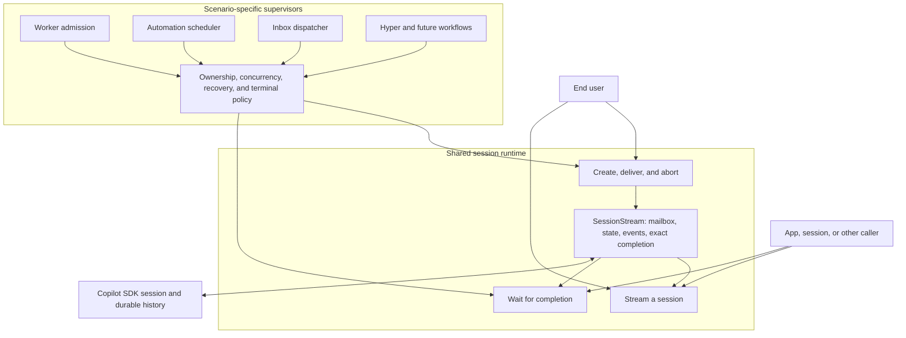

# Session Runtime

A session is Toy Box's core compute primitive: an addressable agent process that can outlive the browser that started it, receive queued messages, and serve multiple subscribers and callers. Its durable identity, SDK history, workspace, and owned resources survive individual executions; `SessionStream` is the one live incarnation currently processing that session's mailbox. This resembles the Erlang/Elixir process model as an architectural analogy, not as an implementation claim about isolation or fault tolerance.

The end user directly supervises an ordinary session. Scenario-specific supervisors instead govern managed sessions for workers, Automations, Inbox, Hyper, and future workflows. Every waiter uses the same session completion mechanism; a supervisor is distinguished by lifecycle authority, not a special kind of wait. It owns admission, concurrency, context, cancellation, recovery, and what to retain, delete, record, or publish when execution ends. The runtime supplies the common process mechanics and exact execution receipts without defining a generic supervisor abstraction.

## Session operations

The runtime exposes the session operations directly:

1. **Create** turn-bearing SDK history through its required first message. A draft may already own a durable workspace, but the SDK's experimental empty-session surface does not make that workspace resumable.
2. **Deliver** a message to an existing session. The runtime decides whether it starts immediately or queues behind active execution; a queued user message may request immediate delivery.
3. **Stream** through a subscription to ordered live events, with cursor replay after reconnect.
4. **Wait** for completion. `waitForSession` covers the announced, live, or latest persisted execution by session ID; a delivery receipt binds a supervisor to the exact execution it started.
5. **Control** by renaming, steering or cancelling queued input, aborting, rewinding an idle conversation, deleting, or applying worktree operations.

Control is a category, not one runtime method. Abort, queue steering, and queue cancellation act on live execution; rename, deletion, and worktree commands delegate through the session API to the registry or resource owner described in the state guide. Rewind resolves the selected user-message timestamp against the SDK's current rewind boundaries, removes that root user turn and every later conversation event while preserving files, and lets the SDK reject a concurrent busy session. Normal draining and steering share one private queue claim; steering sends its claim through the SDK's immediate mode without opening another turn boundary.

Once a session has turn-bearing history, resume is not a separate operation. Delivering to an idle session resumes its persisted SDK session; delivering to an active session queues. Callers do not choose whether a new turn starts or a message enters the active mailbox, though an active user delivery may request immediate dispatch.

`streamSession` is the connected composite: it subscribes before delivering an optional message, preventing a fast first event from falling between separate requests. The same request can start a draft's first turn or create a session with its required first message, deliver to an existing session, or subscribe without delivering. Headless callers use `createSession`, `deliverSessionMessage`, and `waitForSession` directly. Scenario supervisors compose those operations with their own policy; for example, worker admission and supervision live in the [Workers feature](../../../workers/AGENTS.md), not in the generic runtime.

## Live execution

`SessionStream` names the live runtime for one session, not the event stream a client reads. It owns the SDK handle, canonical state, queued messages, completion waiters, and replayable event bus for that execution lifetime.

A worker does not add another execution mode to `SessionStream`. Its durable record names one session, file, or app owner and an independent `ephemeral` lifetime. The worker supervisor composes ordinary session creation with optional inherited context, an exact completion receipt, a cancellation guard that closes the race before the stream exists, and deletion after execution when ephemeral. `create_worker_session` creates a durable session-owned child by default but can make one ephemeral. File workers are always ephemeral; app workers default to ephemeral but may remain available for multi-turn coordination. Hyper's `create_session` creates an ordinary standard session with no worker owner or caller-state lookup. Startup sweeps ephemeral workers abandoned by a previous process and does not resume their execution.

Inbox dispatch, automation scheduling, and worker admission supervise sessions because their terminal policies differ: Inbox preserves reported results, Automations record run metadata, and workers apply an explicit lifetime. The runtime centralizes execution and exact completion; scenario-specific policy stays with the scenario rather than entering an enum, strategy interface, or alternate execution model.

1. Acquisition is single-flight. A caller joins an existing stream, shares an in-progress creation, creates a new SDK session, or resumes an idle session from its reduced snapshot and SDK handle.
2. Connected callers subscribe before delivery. Every logical message has a unique client ID; `SessionStream.deliver` synchronously claims the first turn or emits `message_queued` behind active execution. Only queued user messages can be steered, and steering marks that same queue entry while awaiting delivery so reloads preserve its state. The runtime records sent client IDs in order and adds each one to the corresponding canonical SDK input event after the projector has filtered subagent and skill inputs. That event removes a queued input, reconciles browser optimism when present, and otherwise appends normally.
3. The SDK projector translates raw events into canonical `SessionEvent`s. The event bus stamps a process-monotonic `eventId`, and the shared reducer returns the next immutable `Session`.
4. When the SDK session reports idle, the runtime drains the next queued message through the same path. `assistant.turn_end` ends only an agent-loop segment and does not drain the queue. With no queued work, the runtime finishes the execution.
5. Finishing publishes one terminal `end`, caches the resulting clean state, selects idle or unread from the active subscriptions, and then disposes the live runtime. Disposing is private resource release: it closes the event bus, resolves waiters, removes the SDK listener, and releases the registry entry. Aborting interrupts SDK work and then finishes; session deletion removes the live runtime without publishing ordinary idle/unread state.

A delivery receipt exposes the initial `started` or `queued` decision and a waiter bound to that exact stream instance. Completion reports `completed`, `failed`, or `timed_out`, plus the latest substantive assistant response when available. Waiting by session ID also covers work announced before its stream exists and falls back to the final snapshot when no live stream remains. A timeout ends only that caller's wait; it does not abort the session or alter its supervisor's policy.

## Subscriptions and client orchestration

The per-session event bus provides bounded cursor replay and live fan-out. It registers a subscriber immediately, before iteration begins, so synchronous producers cannot outrun subscription. Existing subscribers retain pending events when future replay is cleared between message deliveries; clients that miss more than the retained window recover from the authoritative detail snapshot.

Subscriptions are either `active` or `passive`. Both receive the same live data. An active subscription acknowledges that the user is watching, so a clean finish becomes idle; a stream that finishes without one becomes unread. Passive previews stay live without suppressing that unread transition.

`useSession` is the browser orchestration boundary for one pane. It hydrates an idle snapshot, subscribes while visible, reduces incoming events, batches rapid text deltas to animation frames, and ends its subscription immediately when the pane closes or the page becomes hidden. Ending a subscription does not stop server work; aborting is the separate control that does. `SessionPane` composes this lifecycle with transcript presentation, linked panes, and the composer without owning runtime policy.

## Realtime planes

Toy Box keeps two event planes separate because they promise different things:

| Plane                | Contract                                                                                                                      |
| -------------------- | ----------------------------------------------------------------------------------------------------------------------------- |
| Session event stream | One session, ordered canonical events, cursor replay, multi-client fan-out, and terminal `end`                                |
| Shared update stream | `WorkspaceEvent` hints, at-most-once delivery, no replay, and repair through authoritative snapshots or React Query refetches |

Transcript continuity belongs to the session event stream. Drafts, running and unread state, Inbox entries, session-list metadata, and automation changes belong to the shared update plane. The `/api/workspace` SSE transport carries one `WorkspaceEvent` algebra, while client-issued `WorkspaceAction`s are commands sent through RPC. Broadcast is its internal fan-out mechanism, not another protocol; one failed client listener cannot fail the producing operation or interrupt the other clients. Do not add transcript replay semantics to broadcast or use broadcast as session truth.

## Boundaries and invariants

- The top-level session server functions validate transport input and delegate. Runtime policy belongs here, SDK translation belongs in [`../sdk/AGENTS.md`](../sdk/AGENTS.md), and authority or teardown belongs in [`../state/AGENTS.md`](../state/AGENTS.md).
- [`../../model/reducer.ts`](../../model/reducer.ts) is the one transition function for live server state, SDK history replay, browser streaming, and reconnect replay. Adding a second event interpretation path is an architectural regression.
- Session deletion delegates complete resource teardown to the state registry; runtime callers must not release stream state or adjacent resources independently.
- Process-wide registries survive development module reloads but not process restart. Durable recovery comes from SDK history, SQLite metadata, and files, never from replay buffers or cached handles.
